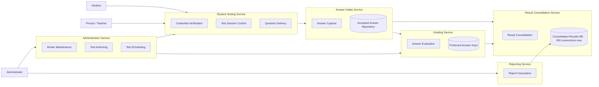

# Make The Grade - Week 3 Style and Granularity Deliverable

## 1. Style Shortlist and Trade-Off Matrix

Scoring: 1 = weak fit, 5 = strong fit.

| Driving characteristic | Modular monolith | Service-based + event-driven answer path | Full microservices | Pure event-driven architecture |
| --- | --- | --- | --- | --- |
| Reliability / durability | 2 - Simpler deployment reduces some distributed failure modes, but one application failure can affect sign-in, testing, answer capture, and admin work together. It also puts too much pressure on the same runtime during peak testing. | 5 - Answer capture can be isolated from admin/reporting work, and accepted answers can be written to a durable intake log before the student advances. Consolidation can replay from that durable source if downstream processing fails. | 4 - Fault isolation is strong, but no-lost-answer behavior becomes harder because more services, contracts, and distributed failure paths are involved. | 4 - Durable messaging is a good match for no-lost-answer intake, but complete workflow state and error recovery are harder to reason about across many asynchronous processors. |
| Scalability / elasticity | 1 - The whole application scales as one unit. That is a poor fit for 200000 concurrent students because answer capture, question delivery, admin maintenance, and reporting do not need the same scale profile. | 5 - Student testing and answer intake scale independently from admin/reporting. Final result consolidation can throttle writes so the relational answer database stays within the 300 connection limit. | 5 - Strong independent scaling, especially if each bounded context owns its data and deployment. However, the operational cost is high for the first six-month release. | 5 - Asynchronous event processors and competing consumers can scale the answer stream well. The trade-off is added complexity for deterministic session behavior. |
| Security | 3 - Security can be implemented with internal modules and access controls, but answer keys, student access, admin functions, and reporting live inside one deployable unit. A mistake in one area has a larger blast radius. | 4 - Answer keys, student sessions, answer intake, and admin maintenance can have separate service boundaries and access rules. Security improves without exploding the service count. | 4 - Strong isolation is possible, but many endpoints and service-to-service contracts increase the surface area that must be secured and governed. | 3 - Asynchronous contracts and event payloads must be governed carefully to avoid exposing answer keys, student data, or over-broad payloads. |

## 2. Architecture Decision Record

### ADR-003: Use Service-Based Architecture with an Event-Driven Answer Path

**Status:** Accepted for the Week 3 recommendation

**Context**

Make The Grade must support 800000+ students, with up to 200000 taking tests at the same time. The most important business statement is that no student answers are ever lost. The final relational test answer database is shared across all scores and has a maximum of 300 connections, which makes it unsafe for every student-facing request to write directly to that database during peak testing.

The system also has a six-month delivery constraint and only two administrators. This means the architecture should avoid unnecessary service sprawl. The student testing path needs high scale and durability; admin maintenance and reporting need correctness and security but not the same peak throughput.

Candidate styles considered:

- Modular monolith
- Service-based architecture with an event-driven answer path
- Full microservices
- Pure event-driven architecture

**Decision**

We will use a service-based architecture with a small number of coarse-grained independently deployed services, plus an event-driven answer intake and result consolidation path.

The student hot path will stay mostly request-based for predictable test flow:

- Student signs in.
- Session control checks schedule and proctor state.
- Question delivery returns the next forward-only question.
- Answer intake accepts the answer and durably records it.
- The next question is presented only after answer acceptance is confirmed.

After acceptance, answer grading and final consolidation may happen asynchronously. The final relational answer database will be written by controlled consolidation workers, not directly by every concurrent student request. This protects the 300 connection limit and gives the system a replayable source of accepted answers.

**Consequences**

Positive consequences:

- The answer capture path can be scaled and hardened separately from admin and reporting.
- Accepted answers have a durable recovery point before final database consolidation.
- The final answer database is protected by throttled consolidation workers.
- Security boundaries can protect answer keys and administrative functions.
- The service count stays low enough for a six-month delivery timeline.

Negative consequences:

- The system is more operationally complex than a modular monolith.
- Reports may be eventually consistent until consolidation completes.
- The team must build idempotent answer writes, retry handling, reconciliation, and monitoring.
- Service contracts must be governed so the testing path does not become too chatty.

**Compliance**

- Every submitted answer must receive a stable answer id and be written to durable intake before the student advances.
- Answer intake writes must be idempotent by student, test session, and question number.
- Result consolidation must enforce a hard maximum of 300 relational database connections.
- Answer keys must never be sent to student clients or stored in event payloads.
- Monitoring must show accepted-answer count, graded-answer count, consolidated-answer count, replay lag, failed writes, and reconciliation gaps.

**Notes**

This decision intentionally avoids a full microservices architecture for the first release. Microservices score well for scalability and isolation, but the kata does not require many independently evolving product domains. The risk of overly fine-grained services is extra workflow coupling, extra contracts, and more operational burden than the six-month timeline needs.

## 3. Candidate Services and Contained Components

### Candidate Service Diagram

### Candidate Service Boundary Table

| Candidate service | Contained Week 2 logical components | Boundary choice | Granularity drivers | Granularity integrators / costs |
| --- | --- | --- | --- | --- |
| Student Testing Service | Credential Verification, Test Session Control, Question Delivery | Merge these into one coarse student-facing service for first release. | Low-latency workflow; same student/session context; proctor time-up control; forward-only navigation. | These components are chatty by nature. Splitting them would add synchronous calls on the timed student path. |
| Answer Intake Service | Answer Capture, Accepted Answer Repository write path | Split from Student Testing Service. | Highest reliability need; independent peak scale; answer durability before advance; fault isolation from question/session logic. | Must coordinate with session control so the student advances only after answer acceptance. Requires idempotency and retry design. |
| Grading Service | Answer Evaluation, protected answer-key lookup | Split from Answer Intake as a protected service. | Answer keys need stricter security; grading rules differ by question type; secondary short answer may evolve separately. | If synchronous grading is required for every question, this adds latency. For first release, capture should not depend on final consolidation. |
| Result Consolidation Service | Result Consolidation | Split as an asynchronous worker service. | Protects the 300-connection relational database limit; replay/reconciliation responsibility; scales differently from student requests. | Reports are eventually consistent until consolidation catches up. Needs operational monitoring. |
| Administration Service | Roster Maintenance, Test Authoring, Test Scheduling | Merge into one admin service with internal modules. | Only two admins; low throughput; shared admin authentication; strong data-integrity workflows between roster, test content, and schedules. | Test authoring and roster data have different security details, so internal authorization still matters. |
| Reporting Service | Report Generation | Split from Administration Service. | Reports can be expensive and should not affect student testing or admin maintenance; post-test workload has different performance profile. | Needs read access to consolidated results and question metadata; must not read from the student hot path. |

## 4. Considered and Rejected

**Modular monolith:** Rejected as the primary style. It is attractive for the six-month deadline and would be simpler to build, but it does not fit the peak scale and fault-isolation needs. Scaling the whole system to support the answer hot path would waste resources and increase blast radius.

**Full microservices:** Rejected for the first release. It scores well on independent scalability and fault isolation, but the kata has a small admin domain and a very focused testing workflow. Too many fine-grained services would increase synchronous workflow coupling, contract management, and operational cost.

**Pure event-driven architecture:** Rejected as the overall style. It is strong for answer intake and consolidation, but the timed test experience needs deterministic request/response behavior for sign-in, question delivery, forward-only movement, and proctor time-up control.

