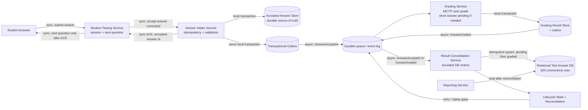
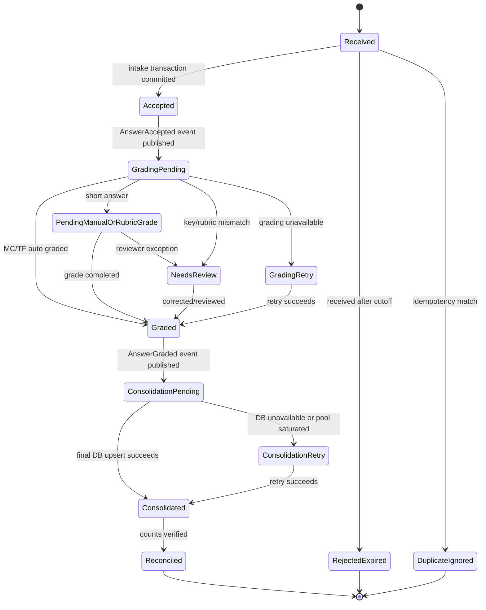

# Make The Grade - Week 4 Transactions, Sagas, and Failure Deliverable

## 1. Student Answer Lifecycle Diagram

The timed student path stays synchronous only through answer acceptance. The student should not wait for final grading or final relational database consolidation. Once the answer is durably accepted, the system can show the next question.

Short answers for secondary students are captured exactly like multiple choice and true/false answers, but they may move into a `PendingManualOrRubricGrade` state before final right/wrong grading is available.

Result Consolidation may write a pending-grade row as soon as it receives `AnswerAccepted`, then update the same row when `AnswerGraded` arrives. That keeps the final database on a reliable path without forcing the student to wait for grading.

## 2. Communication and Coordination Strategy

| Workflow point | Communication | Coordination choice | Reason |
| --- | --- | --- | --- |
| Sign in and session start | Synchronous | Orchestrated by Student Testing Service | The student needs an immediate yes/no decision based on identity, assigned teacher, schedule, grade, and proctor state. |
| Get next question | Synchronous | Orchestrated by Student Testing Service | The test is timed and forward-only, so question delivery must be fast and deterministic. |
| Submit answer and advance | Synchronous until durable acceptance | Student Testing coordinates with Answer Intake | The student should advance only after the answer is durably recorded. This is the key "no lost answers" checkpoint. |
| Grade accepted answer | Asynchronous | Choreographed event consumer with lifecycle tracking | Grading does not need to block the student, and short answers may not be immediately graded. |
| Consolidate final result | Asynchronous | Orchestrated by Result Consolidation / Reconciliation | Final DB writes must be throttled because the relational database has a 300-connection maximum. |
| Generate reports | Synchronous request, asynchronous/report job if large | Reporting reads reconciled results | Reports happen after testing and should not interfere with the student test path. |

Recommended pattern: a Parallel Saga style for the answer lifecycle: asynchronous communication, eventual consistency, and an explicit lifecycle state owner. This gives the scale of async processing while keeping a reliable answer status that can be queried and repaired.

Rejected communication choices:

| Rejected choice | Why rejected |
| --- | --- |
| Fully synchronous answer -> grade -> consolidate before next question | Too slow for timed tests and risky against the 300-connection database limit. |
| Pure choreography with no lifecycle state owner | Scales well, but makes it too hard to answer "where is this student's answer?" during failures. |
| Two-phase commit across intake, grading, and final DB | Too much coupling and too fragile at 200000 concurrent students. |
| Student clients writing directly to final answer DB | Unsafe for security, connection limits, and answer integrity. |

## 3. Transaction Strategy

Core rule: an accepted answer is never deleted or compensated away. Failures are handled with forward recovery: retry, replay, regrade, supersede, or manual review.

| Boundary | Local transaction | Consistency strategy | Notes |
| --- | --- | --- | --- |
| Answer acceptance | Insert accepted answer, record received timestamp, enforce idempotency key, write outbox event | Strong local consistency | Unique key: `test_session_id + student_id + question_id`. This prevents duplicate answers if the browser retries. |
| Session advancement | Advance to next question only after acceptance ACK | Strong workflow rule | If session state is in the same store, update it in the same transaction. If not, session advancement is idempotent and based on accepted answer id. |
| Grading | Read accepted answer and protected answer key version; write grade result or pending short-answer state | Eventual consistency | Answer keys stay inside the grading boundary. Events carry answer id and key version, not the answer key. |
| Result consolidation | Upsert accepted answer as pending grade, then update grade/completion status when available | Eventual consistency with idempotent writes | Consolidation workers use a bounded connection pool so total DB connections never exceed 300. |
| Reconciliation | Compare accepted, graded, and consolidated counts; replay missing events | Eventual repair | The accepted answer store is the durable source for rebuilding downstream state. |
| Reporting readiness | Mark reports ready only after reconciliation thresholds pass | Read consistency after testing | Students do not need immediate results, so reports can wait for complete consolidation. |

### Answer Lifecycle State Machine

## 4. Failure Scenarios

| Failure scenario | What the student sees | What is lost? | Automatic recovery | Human action |
| --- | --- | --- | --- | --- |
| Browser double-clicks submit or retries after timeout | Same answer accepted once; next question appears when ACK returns | Nothing | Idempotency key returns existing accepted answer id | None |
| Answer Intake unavailable before commit | Student stays on same question and sees retry/temporary error | No committed answer exists yet | Client retries; proctor can allow refresh/resume | Only if outage persists |
| Answer committed but ACK lost before browser receives it | Student may retry same question | Nothing | Retry returns existing accepted answer id and advances | None |
| Queue/event publishing fails after answer commit | Student still advances because answer is safely stored | Nothing | Transactional outbox republishes `AnswerAccepted` | None unless outbox stuck |
| Grading service unavailable | Student continues test | Nothing | Answer remains `GradingRetry`; workers retry from durable event | Human only if retries exceed threshold |
| Secondary short answer cannot be graded immediately | Student continues test and sees no score | Nothing | State remains `PendingManualOrRubricGrade` until grading completes | Grader/reviewer may need to complete grade |
| Final answer DB at connection limit or down | Student continues test; reports delayed | Nothing | Consolidation workers back off and retry; accepted store can replay | Admin notified if lag breaches SLA |
| Proctor ends test while answer is in flight | If server received before cutoff, answer is accepted; otherwise test exits | Nothing after accepted checkpoint | Server-side timestamp/cutoff decides outcome | Proctor/admin reviews disputes using audit log |
| Answer key version mismatch | Student continues test | Nothing | Mark `NeedsReview` or regrade against correct version | Admin/grader resolves bad version if needed |
| Reporting requested before consolidation complete | Report shows not-ready/internal partial status, not final scores | Nothing | Reconciliation completes and marks reports ready | Admin waits or investigates reconciliation gaps |
| Malicious student submits modified grade/question payload | Submission rejected or normalized to server-side question/session state | Nothing valid is lost | Server ignores client-supplied grade/key/question order | Security review if repeated attack pattern appears |

## 5. Resulting Design Commitments

- The accepted answer store is the durable source of truth for student submissions.
- The next question is shown only after the accepted answer transaction commits.
- Grading and final consolidation are asynchronous because students do not need immediate results.
- Final database writes are isolated behind Result Consolidation workers with a bounded connection pool.
- Every downstream processor is idempotent and replayable from accepted answers.
- Reports are generated from reconciled final results, not from the live student hot path.
- Security-sensitive material, especially answer keys and grading rules, stays out of student clients and event payloads.

## 6. Fitness Checks

| Fitness check | Target |
| --- | --- |
| Accepted answer durability | 100% of ACKed answers exist in accepted answer store |
| Duplicate answer handling | Duplicate submits return the original answer id |
| Outbox health | No unpublished accepted-answer events beyond SLA |
| Grading lag | MC/TF graded within operational SLA; short answers tracked separately |
| Consolidation lag | All accepted answers eventually reach final DB or explicit review state |
| Final DB protection | Connection pool stays at or below 300 connections |
| Reconciliation | Accepted count = consolidated count + explicit terminal exception count before reports |
| Security | No answer key or correct-answer payload leaves the grading boundary |
